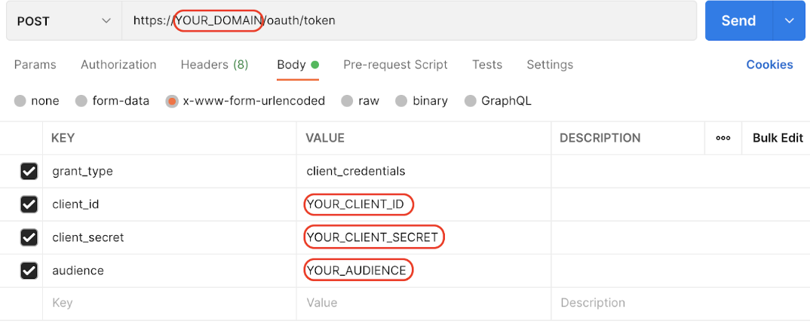

# intro to Spring Security 2

project1: [ku.kinkao](https://github.com/KU-SKE17/kinkao)

demo-project: ku.review

## apis test paths

- POST: http://localhost:8091/api/review
  ```json
  {
    "restaurantId": "6b8ebeb6-9737-40b0-82f9-a8ecd21fbb55",
    "username": "Alice",
    "reviewText": "Salad is yummy!"
  }
    ```
- GET: http://localhost:8091/api/review/[:restaurantId]

## get token

from Auth0

- login auth0.com
- create api project
- go to the project dashboard, test -> curl
  
- set returned token as `Bearer Token`

